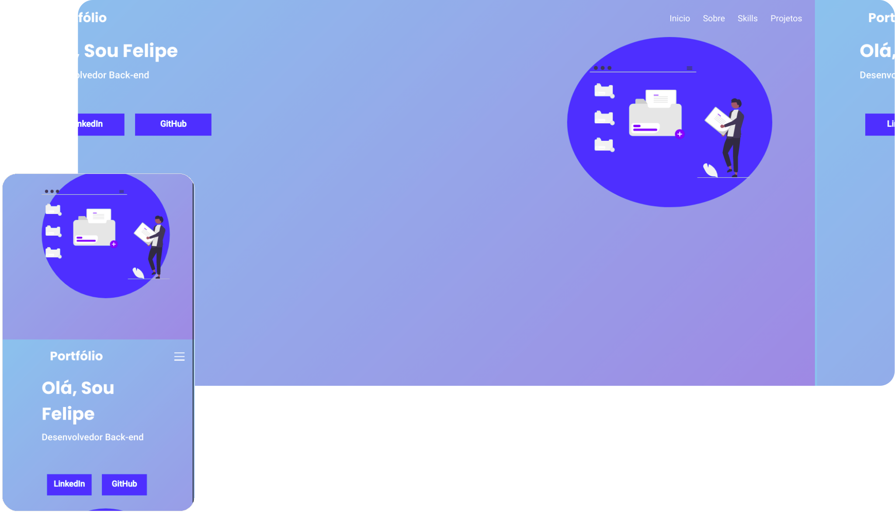

<h1 align="center">Portfólio Web</h1>
<h3 align="center">
  
</h3>

# :sparkles: Tecnologias

Esse projeto foi desenvolvido com as seguintes tecnologias:

- [Next.Js](https://nextjs.org)

## :rocket: Como executar

# Clone o repositório

```sh
git clone https://github.com/Feliper-Silva/portifilio-next
```

```sh
# baixar dependências
npm install
```

```sh
# iniciar a aplicação.
npm run dev
```

Por fim, a aplicação estará disponível em http://localhost:3000/api

## :page_facing_up: Licença

Esse projeto está sob a licença MIT. Veja o arquivo [LICENSE](LICENSE.md) para mais detalhes.
